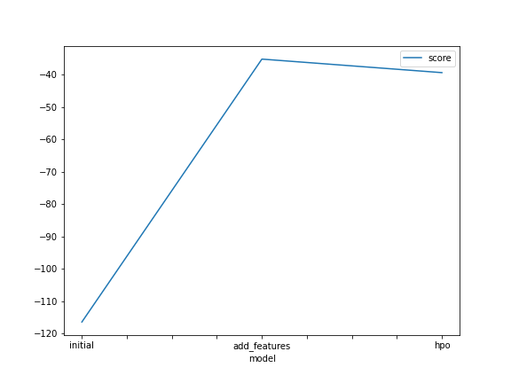
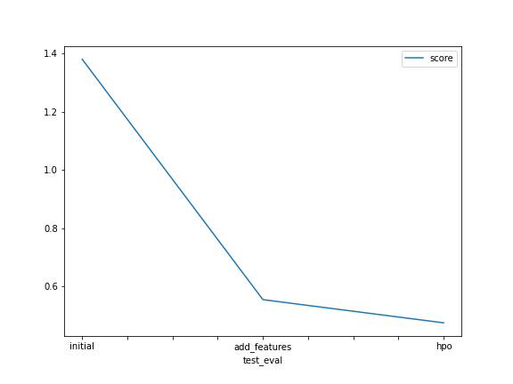

# Report: Predict Bike Sharing Demand with AutoGluon Solution
#### Muhamad Kurniawan

## Initial Training
### What did you realize when you tried to submit your predictions? What changes were needed to the output of the predictor to submit your results?
Some prediction results show a negative value. The kaggle system in this competition only accepts scores above 0. Negative scores can be zeroed so that they can be submitted to kaggle.

### What was the top ranked model that performed?
Weighted Ensemble Model

## Exploratory data analysis and feature creation
### What did the exploratory analysis find and how did you add additional features?
TODO: Add your explanation

### How much better did your model preform after adding additional features and why do you think that is?
It significantly improve the score. The MAE score decrease about 50%.

## Hyper parameter tuning
### How much better did your model preform after trying different hyper parameters?
The score from training process is worse, but the MAE score from test data is improved.

### If you were given more time with this dataset, where do you think you would spend more time?
Doing more exploratory data analysis and hyperparameter optimization. 

### Create a table with the models you ran, the hyperparameters modified, and the kaggle score.
|model|time_limit|preset|model_hpo|score|
|--|--|--|--|--|
|initial|600|best_quality|default|1.38027|
|add_features|600|best_quality|default|0.55472|
|hpo|600|best_quality|CatBoost, GBM, NN|0.47508|

### Create a line plot showing the top model score for the three (or more) training runs during the project.

### Create a line plot showing the top kaggle score for the three (or more) prediction submissions during the project.

## Summary
With autogluon library, we can easily compare and find the best machine learning model to apply to our dataset. Feature engineering is important process to improve the score of our machine learning model. Hyperparameter optimization is needed too to improve our score.
